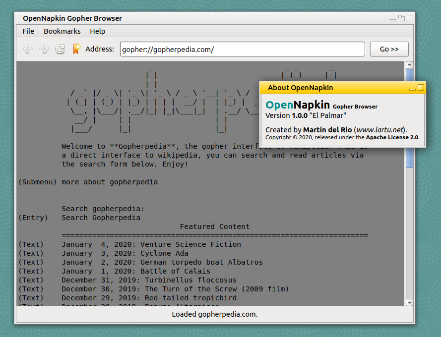

<h1 align="center">OpenNapkin</h1>

  
  

**OpenNapkin** is a graphical [Gopher](https://en.wikipedia.org/wiki/Gopher_(protocol)) client written in 
[Gambas3](http://gambas.sourceforge.net/en/main.html). I wrote OpenNapkin as I wasn't able to find other
Gopher client that wasn't written for console only or that wasn't part of a much bigger web-browsing suite.
**OpenNapkin** offers just what you can see on the screeshot: a way to load Gopher sites, basic interaction
(double clicking on a line lets you interact with that line) and basic bookmark keeping. Nothing more,
nothing less.

## Screenshots

|||
|:-:|:-:|
| Visiting Gopherpedia.com | Visiting Gopher.black |

## Installing

Just go ahead and download the [latest release](https://github.com/Lartu/OpenNapkin/releases) available.
In order to run OpenNapking you must have `gambas3-runtime` installed on your system (if you are under
Debian or Ubuntu you may install it by running `sudo apt install gambas3-runtime`).

## Contributing

OpenNapkin is a simple Gambas project, if you feel any feature is missing, make yourself at home and add it
or kindly submit an [issue](https://github.com/Lartu/OpenNapkin/issues) to this repository.

## License

OpenNapkin is released under the **Apache 2.0** open source license. Copyright (c) 2020,
[Martín del Río](www.lartu.net).
